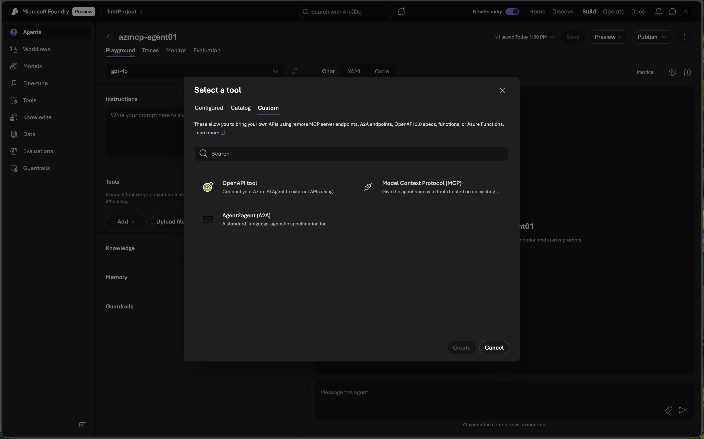

# Fabric MCP Server - ACA with Managed Identity

This document explains how to deploy the [Fabric MCP Server](https://mcr.microsoft.com/product/fabric/fabric-mcp) as a remote MCP server accessible over HTTPS on Azure Container Apps. This enables AI agents from [Microsoft Foundry](https://azure.microsoft.com/products/ai-foundry), [VS Code](https://code.visualstudio.com/), and [Microsoft Copilot Studio](https://www.microsoft.com/microsoft-copilot/microsoft-copilot-studio) to securely invoke MCP tool calls that interact with Microsoft Fabric on your behalf.

Based on the [Azure-Samples/azmcp-foundry-aca-mi](https://github.com/Azure-Samples/azmcp-foundry-aca-mi) reference template, customized for the Fabric MCP Server image.

## Prerequisites

- Azure subscription with **Owner** or **User Access Administrator** permissions
- [Azure Developer CLI (azd)](https://learn.microsoft.com/azure/developer/azure-developer-cli/install-azd)
- [Azure CLI](https://learn.microsoft.com/cli/azure/install-azure-cli) (for verification and troubleshooting)

## Quick Start

```bash
azd up
```

You'll be prompted for:
- **Storage Account Resource ID** - The Azure resource ID of the storage account the MCP server will access
- **Microsoft Foundry Project Resource ID** - The Azure resource ID of the Microsoft Foundry project for agent integration

## What Gets Deployed

- **Container App** - Runs [Fabric MCP Server](https://hub.docker.com/r/microsoft/fabric-fabric-mcp) (`mcr.microsoft.com/fabric/fabric-mcp:latest`) with `publicapis` namespace
- **Role Assignments** - Container App managed identity granted roles for outbound authentication to the storage account specified by the input storage resource ID:
  - Reader (read-only access to storage account properties)
  - Storage Blob Data Reader (read-only access to blob data)
- **Entra App Registration** - For incoming OAuth 2.0 authentication from clients with:
  - `Mcp.Tools.ReadWrite.All` application role (for Foundry agents via managed identity)
  - `Mcp.Tools.ReadWrite` delegated permission scope (for VS Code via user sign-in)
  - VS Code pre-authorization (client app ID `aebc6443-996d-45c2-90f0-388ff96faa56`)
- **Application Insights** - Telemetry and monitoring (optional, can be disabled)

### Deployment Outputs

After deployment, retrieve `azd` outputs:

```bash
azd env get-values
```

Key output values:

```
CONTAINER_APP_URL="https://fabric-mcp-newumage-server.politesand-c956bc4f.eastus.azurecontainerapps.io"
ENTRA_APP_CLIENT_ID="dd21575e-1006-4327-8070-93a0d29c5e7d"
ENTRA_APP_IDENTIFIER_URI="api://dd21575e-1006-4327-8070-93a0d29c5e7d"
ENTRA_APP_OBJECT_ID="a570a46c-50e3-4f2c-aa4a-f90e4016f9c8"
ENTRA_APP_ROLE_ID="b75ee658-458b-5b01-95d4-24dcfba0507c"
ENTRA_APP_SERVICE_PRINCIPAL_ID="ddbc5c93-b715-4279-8a0b-e80b852c8f5f"
```

## Using from VS Code

To connect VS Code to your deployed Fabric MCP Server:

1. Get your `CONTAINER_APP_URL` from `azd env get-values`
2. In VS Code, open MCP server settings and add a new server with:
   - **URL**: Your `CONTAINER_APP_URL` (e.g., `https://fabric-mcp-newumage-server.politesand-c956bc4f.eastus.azurecontainerapps.io/`)
3. VS Code will authenticate using the `Mcp.Tools.ReadWrite` delegated scope via Entra ID

### Troubleshooting VS Code Connection

If VS Code fails to connect with errors like `Failed to fetch authorization server metadata`:

1. **Verify OAuth metadata** returns `https://` URLs (not `http://`):
   ```bash
   curl -s https://<your-container-app-url>/.well-known/oauth-protected-resource
   ```
   The `resource` field must start with `https://`. If it shows `http://`, the `AZURE_MCP_DANGEROUSLY_ENABLE_FORWARDED_HEADERS` env var is missing from the container app.

2. **Verify the `www-authenticate` header** uses `https://`:
   ```bash
   curl -s -i https://<your-container-app-url>/ 2>&1 | grep www-authenticate
   ```

3. **Verify VS Code is pre-authorized** on the Entra app:
   ```bash
   az ad app show --id <ENTRA_APP_CLIENT_ID> --query "api.preAuthorizedApplications" -o json
   ```
   Should include `aebc6443-996d-45c2-90f0-388ff96faa56` (VS Code client app ID).

4. **Verify the delegated scope exists** on the Entra app:
   ```bash
   az ad app show --id <ENTRA_APP_CLIENT_ID> --query "api.oauth2PermissionScopes[].value" -o json
   ```
   Should include `Mcp.Tools.ReadWrite`.

## Using from Microsoft Foundry Agent

Once deployed, connect your Microsoft Foundry agent to the Fabric MCP Server running on Azure Container Apps.

1. Get your Container App URL from `azd` output: `CONTAINER_APP_URL`
2. Get Entra App Client ID from `azd` output: `ENTRA_APP_CLIENT_ID`
3. Navigate to your Foundry project: https://ai.azure.com/nextgen
4. Go to **Build** → **Create agent**
5. Select the **+ Add** in the tools section
6. Select the **Custom** tab
7. Choose **Model Context Protocol** as the tool and click **Create** 
8. Configure the MCP connection 

   Fill in the connection fields using one of the two identity types below.

### Option A: Project Managed Identity (recommended for demos & development)

Use this when you want all agents in a Foundry project to share the same access level. This is the simplest setup and is what the Bicep template pre-configures — the `Mcp.Tools.ReadWrite.All` app role is automatically assigned to the Foundry project's managed identity during `azd up`.

| Field | Value |
|---|---|
| **Name** | Any name (e.g., `fabric-mcp`) |
| **Remote MCP Server endpoint** | Your `CONTAINER_APP_URL` |
| **Authentication** | `Microsoft Entra` |
| **Type** | `Project Managed Identity` |
| **Audience** | Your `ENTRA_APP_CLIENT_ID` |

No additional setup is needed — select **Connect** and the agent is ready.

### Option B: Agent Identity (recommended for production)

Use this when you need authentication scoped to a specific agent. Each published agent gets its own unique identity, providing tighter access control and independent audit trails. This is the recommended approach for production workloads where agents have different access levels to the same MCP server.

| Field | Value |
|---|---|
| **Name** | Any name (e.g., `fabric-mcp`) |
| **Remote MCP Server endpoint** | Your `CONTAINER_APP_URL` |
| **Authentication** | `Microsoft Entra` |
| **Type** | `Agent Identity` |
| **Audience** | Your `ENTRA_APP_CLIENT_ID` |

**Additional setup required after selecting Agent Identity:**

1. **Get the agent identity ID**: In the Azure portal, go to your Foundry project → **Overview** → **JSON View** (select the latest API version) → copy the `agentIdentityId` value.

2. **Assign the app role to the agent identity**: The agent identity needs the `Mcp.Tools.ReadWrite.All` role on your Entra app's service principal. Use the Graph API:

   ```bash
   # Get the agent identity's principal ID
   az rest --method GET \
     --uri "https://graph.microsoft.com/v1.0/servicePrincipals?$filter=appId eq '<agentIdentityId>'" \
     --query "value[0].id" -o tsv

   # Assign the app role
   az rest --method POST \
     --uri "https://graph.microsoft.com/v1.0/servicePrincipals/<ENTRA_APP_SERVICE_PRINCIPAL_ID>/appRoleAssignments" \
     --body '{"principalId":"<agent-identity-principal-id>","resourceId":"<ENTRA_APP_SERVICE_PRINCIPAL_ID>","appRoleId":"<ENTRA_APP_ROLE_ID>"}' \
     --headers Content-Type=application/json
   ```

   Replace the placeholders with values from `azd env get-values`:
   - `ENTRA_APP_SERVICE_PRINCIPAL_ID` — the service principal of your Entra app
   - `ENTRA_APP_ROLE_ID` — the `Mcp.Tools.ReadWrite.All` role ID

3. **After publishing the agent**: When you publish an agent, it gets a new unique identity. You must re-assign the app role to the new agent identity. This is by design to ensure least-privilege access.

> **Tip**: Use **Project Managed Identity** for rapid prototyping and demos. Switch to **Agent Identity** for production to get per-agent access control, independent audit logging, and least-privilege scoping.

Select **Connect** to associate the connection with the agent.

Your agent is now ready to assist you! It can answer your questions and leverage tools from the Fabric MCP Server to perform operations on your behalf.

## Key Configuration Details

### Container App Environment Variables

| Variable | Purpose |
|---|---|
| `AzureAd__Instance` | Entra ID login endpoint (e.g., `https://login.microsoftonline.com/`) |
| `AzureAd__TenantId` | Azure AD tenant ID |
| `AzureAd__ClientId` | Entra App Client ID for incoming auth |
| `AZURE_MCP_DANGEROUSLY_DISABLE_HTTPS_REDIRECTION` | Set to `true` because Container Apps terminates TLS at the ingress; internal traffic is HTTP within the pod |
| `AZURE_MCP_DANGEROUSLY_ENABLE_FORWARDED_HEADERS` | Set to `true` so the MCP server reads `X-Forwarded-Proto` and advertises `https://` URLs in OAuth metadata. **Required for VS Code connectivity.** |
| `AZURE_TOKEN_CREDENTIALS` | Set to `managedidentitycredential` for outbound auth using the Container App's managed identity |
| `AZURE_MCP_INCLUDE_PRODUCTION_CREDENTIALS` | Enables production credential types |

### Entra App Registration

The Entra app is configured with:

- **Application role** (`Mcp.Tools.ReadWrite.All`): Used by Foundry agents via managed identity (application-level auth)
- **Delegated scope** (`Mcp.Tools.ReadWrite`): Used by VS Code via user sign-in (delegated auth)
- **Pre-authorized client**: VS Code (`aebc6443-996d-45c2-90f0-388ff96faa56`) is pre-authorized for the delegated scope so users don't need admin consent

## Clean Up

```bash
azd down
```

## Template Structure

The `azd` template consists of the following Bicep modules:

- **`main.bicep`** - Orchestrates the deployment of all resources
- **`aca-infrastructure.bicep`** - Deploys Container App hosting the Fabric MCP Server
- **`aca-role-assignment-resource-storage.bicep`** - Assigns Azure storage RBAC roles to the Container App managed identity on the storage account specified by the input storage resource ID
- **`entra-app.bicep`** - Creates Entra App registration with app roles, delegated scopes, and VS Code pre-authorization for OAuth 2.0 authentication
- **`foundry-role-assignment-entraapp.bicep`** - Assigns Entra App role to the managed identity of the Microsoft Foundry project specified by the input Microsoft Foundry resource ID for the Fabric MCP Server access
- **`application-insights.bicep`** - Deploys Application Insights for telemetry and monitoring (conditional deployment)

## Common Errors

### VS Code: "Failed to fetch resource metadata" / "Error populating auth server metadata"

This happens when the MCP server advertises `http://` URLs in its OAuth Protected Resource Metadata instead of `https://`. The Container Apps ingress terminates TLS and forwards requests over HTTP internally, so the MCP server doesn't know the original scheme was HTTPS.

**Fix:** Ensure the `AZURE_MCP_DANGEROUSLY_ENABLE_FORWARDED_HEADERS` environment variable is set to `true` on the container app:

```bash
az containerapp update --name <CONTAINER_APP_NAME> --resource-group <RESOURCE_GROUP> \
  --set-env-vars "AZURE_MCP_DANGEROUSLY_ENABLE_FORWARDED_HEADERS=true"
```

Verify the fix:

```bash
curl -s https://<CONTAINER_APP_URL>/.well-known/oauth-protected-resource
# The "resource" field should show https://, not http://
```

### VS Code: "Waiting for server to respond to initialize request"

This can occur when:

1. The OAuth metadata URLs use `http://` instead of `https://` (see above)
2. The Entra app is missing the `Mcp.Tools.ReadWrite` delegated scope
3. VS Code is not pre-authorized on the Entra app

**Fix:** Ensure the Entra app has the delegated scope and VS Code pre-authorization. If deployed with the updated Bicep templates, `azd up` handles this automatically.

### ServiceManagementReference field is required

```json
{
  "error": {
    "code":"BadRequest",
    "target":"/resources/entraApp",
    "message":"ServiceManagementReference field is required for ..."
  }
}
```

This occurs when deploying (`azd up`) an Entra app registration without a `serviceManagementReference`. The Microsoft Graph API requires this field if your organization requires a Service Tree ID.

**Fix:** Add the GUID to [infra/main.parameters.json](infra/main.parameters.json):

```json
{
  "parameters": {
    "serviceManagementReference": {
      "value": "<your-guid>"
    }
  }
}
```

Then re-run `azd up`.

